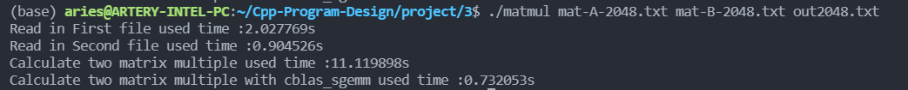

# Project 3 Report
> 樊顺
> 
> 11811901

## The structure of matrix in program

A two dimension array.

In this part, using two int variables to store the length of row and column. And using point(`float** p_mat`) to store the content of matrix.

```c
typedef struct {
    int row_len;
    int col_len;
    float** p_mat;
} Matrix;
```

## Read a matrix from disk to memory

Allocate memory for matrix and read data from file character by character.

At beginning, using the function : `fgetc()` and `EOF` to get the size of input matrix.

Then, use `calloc()` to allocate memory to store the matrix. After allocate memory, read in all numbers and store it into `m->p_mat`.

```c
Matrix* create_mat(char* path) {
    Matrix* m = malloc(sizeof(Matrix));
    m->row_len = 0;
    m->col_len = 0;
    FILE* myfile = fopen(path, "r");
    int ch = 0;
    while (ch != EOF) {
        ch = fgetc(myfile);
        if (m->row_len == 0 && ch == ' ') {
            m->col_len++;
        }
        if (ch == '\n') {
            m->row_len++;
        }
    };

    m->col_len++;

    m->p_mat = calloc(m->row_len, sizeof(float*));
    for (int i = 0; i < m->row_len; i++) {
        m->p_mat[i] = calloc(m->col_len, sizeof(float));
    }

    rewind(myfile);

    for (int i = 0; i < m->row_len; i++) {
        for (int j = 0; j < m->col_len; j++) {
            if (!fscanf(myfile, "%f", &m->p_mat[i][j])) {
                break;
            }
        }
    }

    fclose(myfile);
    return m;
}
```

## Free memory-(delete a matrix)

Delete the matrix and free memory.

Because this is a two dimension array. In order to avoid memory leak, free memory form the inner to the outer.

```c
void delete_mat(Matrix* mat) {
    for (int i = 0; i < mat->row_len; i++) {
        free(mat->p_mat[i]);
    }
    free(mat->p_mat);
    free(mat);
}
```

## Copy the data from a matrix to another

At beginning, make sure the target matrix has nothing inside. Then, init the target matrix by setting the row length, column length and allocate the matrix memory.

Then, copy each value in source matrix to target matrix.

```c
void copy_mat(Matrix* target, Matrix* source) {
    delete_mat(target);
    target->row_len = source->row_len;
    target->col_len = source->col_len;
    target->p_mat = calloc(target->row_len, sizeof(float*));
    for (int i = 0; i < target->row_len; i++) {
        target->p_mat[i] = calloc(target->col_len, sizeof(float));
    }
    for (int i = 0; i < target->row_len; i++) {
        for (int j = 0; j < target->col_len; j++) {
            target->p_mat[i][j] = source->p_mat[i][j];
        }
    }
}
```

## Calculate the multiple of two matrix

Optimize speed by OpenMP. It will fork additional threads to carry out the main progress of calculation, which improves the speed of matrix multiplication.

Using `#pragma omp parallel for` to ensure that the for loop can be split to distribute to each thread for execution as evenly as possible.

```c
Matrix* multiple_mat(Matrix* mat1, Matrix* mat2) {
    Matrix* result = malloc(sizeof(Matrix));
    result->row_len = mat1->row_len;
    result->col_len = mat2->col_len;
    result->p_mat = calloc(result->row_len, sizeof(float*));
    for (int i = 0; i < result->row_len; ++i)
        result->p_mat[i] = calloc(result->col_len, sizeof(float));

#pragma omp parallel for
    for (int i = 0; i < result->row_len; i++) {
        for (int k = 0; k < mat1->col_len; k++) {
            float tmp = mat1->p_mat[i][k];
            for (int j = 0; j < result->col_len; j++) {
                result->p_mat[i][j] += tmp * mat2->p_mat[k][j];
            }
        }
    }

    return result;
}
```

## Write data back to file

Quite easy.

```c
void write_mat(char* path, Matrix* mat) {
    FILE* myfile = fopen(path, "w");
    for (int i = 0; i < mat->row_len; i++) {
        for (int j = 0; j < mat->col_len; j++) {
            if (j == mat->col_len - 1) {
                fprintf(myfile, "%f\n", mat->p_mat[i][j]);
            } else {
                fprintf(myfile, "%f ", mat->p_mat[i][j]);
            }
        }
    }
}
```

## Display Matrix

This function help to show the matrix which is stored in the memory by print out each number.

```c
void display_mat(Matrix* m1) {
    for (int i = 0; i < m1->row_len; i++) {
        for (int j = 0; j < m1->col_len; j++) {
            if (j == m1->col_len - 1) {
                printf("%f\n", m1->p_mat[i][j]);
            } else {
                printf("%f ", m1->p_mat[i][j]);
            }
        }
    }
}
```


## Main program

```c
int main(int argc, char** argv) {
    if (argc != 4) {
        printf("Invalid arguments!\n");
        return 1;
    }
    Matrix* m1 = create_mat(argv[1]);
    Matrix* m2 = create_mat(argv[2]);
    Matrix* result = multiple_mat(m1, m2);

    write_mat(argv[3], result);

    delete_mat(result);
    delete_mat(m2);
    delete_mat(m1);
    return 0;
}
```

## Accuracy analysis

Using python to calculate the same matrix. Then read in the result which calculate by my program as numpy array type and calculate the difference between the read in result and the result using `numpy.dot()`. After that, output the difference as array into the file: `out*-diff.txt`(`*`is the number).

And find out the maximum difference is: `0.022811999995610677`(Find after taking the absolute value of all the differences).

```python
import numpy as np
# * is the number which need be changed.
matrixA = np.loadtxt('./mat-A-*.txt')
matrixB = np.loadtxt('./mat-B-*.txt')
checking = np.loadtxt('./out*.txt')
result = np.dot(matrixA, matrixB)

diff = result - checking
np.absolute(diff)
print(np.max(diff))
[rows, cols] = diff.shape
with open ('./out*-diff.txt','w') as f:
    for i in range(rows):
        for j in range(cols):
            f.write("%.6f "%diff[i, j])
        f.write('\n')
```

## Improve the calculate speed
+ By using `#pragma omp parallel for` to use multiple threads for the for loop, increase the amount of simultaneous calculations, and increase the calculation speed.
+ By using pointers to replace the vector structure used in project2, the speed of reading and writing during calculations can be improved.
+ By assigning addresses, it is ensured that when the addresses are read, the probability of occurrence of misses in the cache can be reduced during the traversal selection.


## Compare with Project-2

+ Change the vector struct to using allocate memory and using pointer.
+ Add accuracy analysis.
+ Using OpenMP to optimize speed in new project.
+ The speed compare:
    + Project 2 : max speed - `32.7107s` in calculate 2048 * 2048 matrix
    + Project 3 : max speed - `11.178487s` in calculate 2048 * 2048 matrix

## Compare with OpenBLAS

After install the OpenBLAS lib. The method is implemented in matrix.c: `Matrix* calc_with_OpenBLAS(Matrix* m1, Matrix* m2)`, after expanding the matrix in the matrix into a one-dimensional matrix, use the `cblas_sgemm` method to calculate the matrix multiplication. After that, the calculation result is stored in the newly created matrix for subsequent output.

```c
Matrix* calc_with_OpenBLAS(Matrix* m1, Matrix* m2){
    Matrix* result = malloc(sizeof(Matrix));
    result->row_len = m1->row_len;
    result->col_len = m2->col_len;
    result->p_mat = calloc(result->row_len, sizeof(float*));
    for (int i = 0; i < result->row_len; ++i)
        result->p_mat[i] = calloc(result->col_len, sizeof(float));
    const int M = m1->row_len;
    const int N = m2->col_len;
    const int K = m1->col_len;
    int lda = K;
    int ldb = N;
    int ldc = N;
    float *A = calloc(M*K, sizeof(float));
    float *B = calloc(K*N, sizeof(float));
    float *C = calloc(M*N, sizeof(float));
    int k = 0;
    for (int i = 0; i < M; i++) {
        for (int j = 0; j < K; j++) {
            A[k] = m1->p_mat[i][j];
            k+=1;
        }
    }
    k = 0;
    for (int i = 0; i < K; i++) {
        for (int j = 0; j < N; j++) {
            B[k] = m2->p_mat[i][j];
            k+=1;
        }
    }
    cblas_sgemm(CblasRowMajor, CblasNoTrans, CblasNoTrans, M, N, K, 1.0f, A, lda, B, ldb, 1.0f, C, ldc);
    k = 0;
    for (int i = 0; i < result->row_len; i++) {
        for (int j = 0; j < result->col_len; j++) {
            result->p_mat[i][j] = C[k];
            k++;
        }
    }
    return result;
}
```
The result is :

And can see the different time. (The OpenBLAS will faster than this, because in this function expanding two two-dimension matrixes into a one-dimensional matrixes. This means that some time is spent on non-computing aspects.)