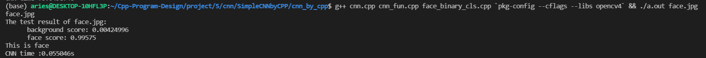
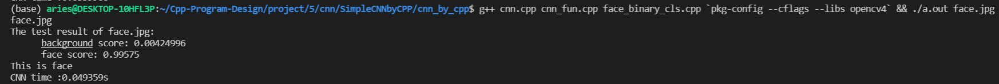
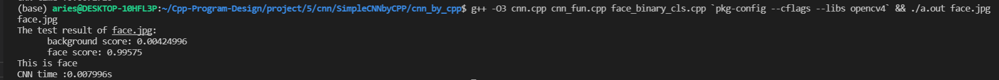
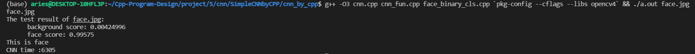
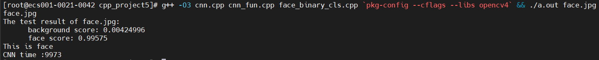

> 11811901
> 樊顺
[TOC]
## Part 1 - Data Input
For this part of reading, I first read the data through opencv's imgread, and then dump the data into my own one-dimensional array.
Since the dot product is used in the convolution, I disassembled some of the content in the previous project2-4.
The code to read in the data is as follows:
```c++
// read in part
try
{
	image = imread(imgdir);
	for (int curChannel = 0; curChannel < IMG0_CNS; curChannel++)
	{
		for (int curRow = 0; curRow < IMG0_SIZE; curRow++)
		{
			for (int curCol = 0; curCol < IMG0_SIZE; curCol++)
			{
				img[curChannel * IMG0_SIZE * IMG0_SIZE + curRow * IMG0_SIZE +
					curCol] =
					image.at<Vec3b>(curRow, curCol)[IMG0_CNS - 1 - curChannel] /
					(float)255;
			}
		}
	}
}
catch (const exception &e)
{
	cerr << "\nInvalid directory. Please enter again.\n";
}
```
## Part 2 - Convolution Layer

### Function Signature

In this part I put convolution and ReLU together, and the method signature is:
```c++
void conv_relu(const float *pic, const int pic_size, const int pic_cns,
               float *fm, const int fm_size, const int fm_cns,
               const float *weight, const float *bias, const int stride);
```
These parameters represent
+ `const float *pic` : The data pointer of the input picture is a one-dimensional array.
+ `const int pic_size` : Enter the length and width of the picture (length and width are equal).
+  `const int pic_cns`  : Enter the number of channels for the picture.
+ `float *fm`  : A pointer to the location of the output convolution result.
+ `const int fm_size` : The output size after convolution.
+ `const int fm_cns` : The output size after convolution.
+ `const float *weight` : The weight matrix of the convolution kernel.
+ `const float *bias` : The bias value after convolution.
+ `const int stride` : The bias data matrix used in convolution.


### Function Body

The convolution process is as follows. Find the corresponding convolution kernel weight for each 3*3 pane of data, and put the calculated value into the output array.
When storing, divide the row and column with the step length to get the integer part, which is the location where the corresponding result should be stored.

```c++
void conv_relu(const float *pic, const int pic_size, const int pic_cns,
               float *fm, const int fm_size, const int fm_cns,
               const float *weight, const float *bias, const int stride)
{
    float get_img_part[9];
    float get_weight[9];
    int kernelStart;
    int index;
    float sum;
    int count;
    for (size_t curOutChan = 0; curOutChan < fm_cns; curOutChan++)
    {
        for (size_t curRow = 0; curRow < pic_size; curRow += stride)
        {
            for (size_t curCol = 0; curCol < pic_size; curCol += stride)
            {
                sum = bias[curOutChan];
                for (size_t curInChan = 0; curInChan < pic_cns; curInChan++)
                {
                    kernelStart = curOutChan * pic_cns * 9 + curInChan * 9;
                    for (size_t temp = 0; temp < 9; temp++)
                    {
                        get_weight[temp] = weight[kernelStart + temp];
                    }
                    
                    index = curInChan * pic_size * pic_size +
                            curRow * pic_size + curCol;
                    count = 0;
                    curRow -= 1;
                    curCol -= 1;
                    for (size_t i = 0; i < 3; i++)
                    {
                        for (size_t j = 0; j < 3; j++)
                        {
                            if (curRow + i < 0 || curCol + j < 0 
                            || curRow + i >= pic_size || curCol + j >= pic_size)
                                get_img_part[count] = 0.0f;
                            else
                                get_img_part[count] = pic[index + i * pic_size + j];
                            count += 1;
                        }
                    }
                    curRow += 1;
                    curCol += 1;
                    sum += mult(get_img_part, get_weight, 9, 0, 0);

                }
                if (sum < 0.0f)
                    fm[curOutChan * fm_size * fm_size +
                       curRow / stride * fm_size +
                       curCol / stride] = 0.0f;
                else
                    fm[curOutChan * fm_size * fm_size +
                       curRow / stride * fm_size +
                       curCol / stride] = sum;
            }
        }
    }
}
```
From the code above, the if behind is the part of ReLU.

## Part 3 - Pooling Layer
### Function Signature
In this part, Max-Pooling is implemented in accordance with the ROI part in project4.
The method signature is as follows:
```c++
void pooling(const float *pic, const int pic_size, const int cns,
             float *pic_pool, const int pic_pool_size);
```
These parameters represent:
+ `const float *pic` : The pointer of the input image matrix.
+ `const int pic_size` : Enter the size of the image.
+ `const int cns` : Enter the number of channels of the image.
+ `float *pic_pool` : A pointer to the storage location of the output image.
+ `const int pic_pool_size` : The size of the output image.
### Function body
This part mainly realizes Max-Pooling by searching for the maximum value in the 3*3 interval, and then replacing the data in the original position.
The specific implementation code of the function is as follows:
```c++
void pooling(const float *pic, const int pic_size, const int cns,
             float *pic_pool, const int pic_pool_size)
{
    int index;
    float max;
    for (size_t c = 0; c < cns; c++)
    {
        for (size_t i = 0; i < pic_size; i += 2)
        {
            for (size_t j = 0; j < pic_size; j += 2)
            {
                index = c * pic_size * pic_size + i * pic_size + j;
                max = 0.0f;
                for (size_t row = 0; row < 2; row++)
                {
                    for (size_t col = 0; col < 2; col++)
                    {
                        if (pic[index + row * pic_size + col] > max)
                        {
                            max = pic[index + row * pic_size + col];
                        }
                    }
                }
                pic_pool[c * pic_pool_size * pic_pool_size +
                         i / 2 * pic_pool_size +
                         j / 2] = max;
            }
        }
    }
}
```

## Part 3 - Softmax

The output of the fully connected layer is used as the i and j in the softmax, and then the background and face scores can be obtained by calculation.
### Function Body
```c++
void softmax(double e, float bg_pow, float face_pow, float *score){
    float e_bg_pow = pow(e, bg_pow);
    float e_face_pow = pow(e, face_pow);
    float total_tensor = e_bg_pow + e_face_pow;
    score[0] = e_bg_pow / total_tensor;
    score[1] = e_face_pow / total_tensor;
}
```

其中不同的参数的含义如下：
+ `double e` : Natural logarithm.
+ `float bg_pow` : The i corresponding to the background.
+ `float face_pow` : The i corresponding to the face.
+ `float *score` : Scoring of background and face.
## Part 4 - Overview
According to the ideas provided by the teacher, there are three convolutional layers and two pooling layers.
The calling code is as follows:
```c++

    float *img_first_layer = (float *)calloc(IMG1_SIZE * IMG1_SIZE * IMG1_CNS, sizeof(float));
    conv_relu(img, IMG0_SIZE, IMG0_CNS,
              img_first_layer, IMG1_SIZE, IMG1_CNS,
              conv0_weight, conv0_bias, 2);

    float *img_first_layer_pool = (float *)calloc(IMG1_POOL_SIZE * IMG1_POOL_SIZE * IMG1_CNS, sizeof(float));
    pooling(img_first_layer, IMG1_SIZE, IMG1_CNS,
            img_first_layer_pool, IMG1_POOL_SIZE);

    float *img_second_layer = (float *)calloc(IMG2_SIZE * IMG2_SIZE * IMG2_CNS, sizeof(float));
    conv_relu(img_first_layer_pool, IMG1_POOL_SIZE, IMG1_CNS,
              img_second_layer, IMG2_SIZE, IMG2_CNS,
              conv1_weight, conv1_bias, 1);

    float *img_second_layer_pool = (float *)calloc(IMG2_POOL_SIZE * IMG2_POOL_SIZE * IMG2_CNS, sizeof(float));
    pooling(img_second_layer, IMG2_SIZE, IMG2_CNS,
            img_second_layer_pool, IMG2_POOL_SIZE);

    float *img_third_layer = (float *)calloc(IMG3_SIZE * IMG3_SIZE * IMG3_CNS, sizeof(float));
    conv_relu(img_second_layer_pool, IMG2_POOL_SIZE, IMG2_CNS,
              img_third_layer, IMG3_SIZE, IMG3_CNS, conv2_weight, conv2_bias, 2);

```

The following fully connected layer is written as follows:
```c++
float bg_pow = mult(img_third_layer, fc0_weight, 2048, 0, 0) + fc0_bias[0];
float face_pow = mult(img_third_layer, fc0_weight, 2048, 0, 2048) + fc0_bias[1];
```

## Part5 Code Accuracy Test
In the implementation, I check the accuracy of the code running process mainly by creating a 32\*32 matrix at the beginning of the project.
Then output the convolution result of each layer and the result of pooling and compare with the result manually calculated by yourself.
After that, the image inspection mainly relies on inputting the face or background, and judging whether the model is correct or not according to the scoring situation.
In terms of test data, I am very grateful to the group friends in the QQ group for providing 128\*128 pictures.

## Part6 Optimization
After the CNN was completed, I found that the code was running much faster than my expected results, and the results were basically obtained within 0.1s.
So I simply tried the two acceleration methods using multi-threading and O3 acceleration.
+ Original situation
	+ 
+ Multi-threading optimization situation
	+ 
+ O3 optimization situation
	+ 

## Part7 Run in Different Platform
Here I run the code on the two platforms, both using O3 optimization, and no longer using the second as a unit, to better reflect the gap.
The command to run the program is：
```g++ -O3 cnn.cpp cnn_fun.cpp face_binary_cls.cpp `pkg-config --cflags --libs opencv4` && ./a.out face.jpg```
+ X86 Platform
	+ 
+ ARM Platform
	+ 

